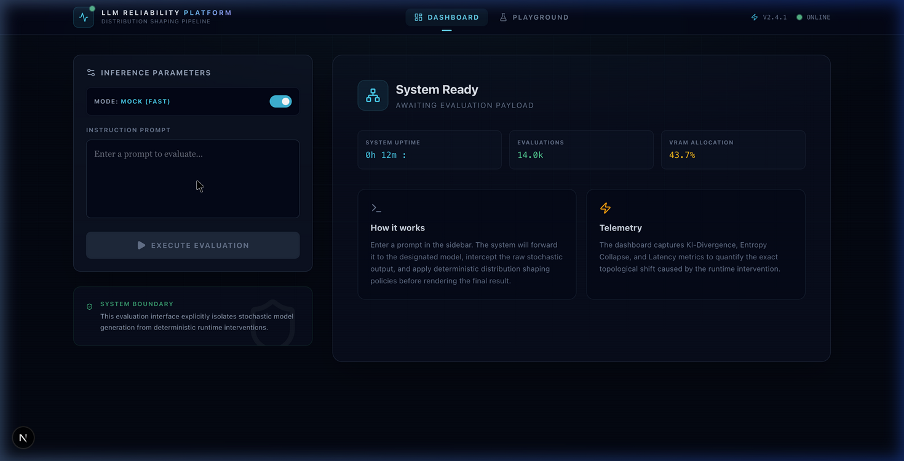
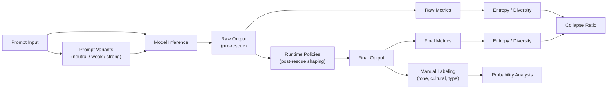

# Probabilistic Evaluation of LLM Inference-Time Behavior

> **A system for analyzing how inference-time policies reshape LLM output distributions.**

> **Note:** This is an earlier iteration / research exploration.
> This work evolved into llm-generation-control : https://github.com/shubhankartiwari99/llm-generation-control

This project is a **systems-level evaluation framework** for analyzing how inference-time runtime policies reshape Large Language Model (LLM) output distributions.

Instead of treating model outputs as final, this work separates:

- **raw model generation (pre-rescue)**
- **post-processed runtime outputs (post-rescue)**

and measures how runtime interventions affect the distribution. These metrics capture different aspects:

- **Entropy** → uncertainty within a distribution
- **Collapse Ratio** → relative compression
- **KL Divergence** → distance between distributions

> Collapse ratio captures entropy reduction but not direction of change.
> KL divergence captures how far the distribution moved.
> Both are required for complete analysis.

---

## 🔍 What This Shows

**Input** ➔ **Raw Model Output** ➔ **Runtime-Shaped Output**

We explicitly measure how inference-time policies change output distributions safely and deterministically, without requiring model weight modifications.

---

## 🎥 Demo

> Demonstration of raw vs runtime-shaped outputs, showing entropy reduction, KL divergence, and real-time inference pipeline behavior.

## 🔁 Inference Modes

### Mock Mode (default)
- Instant responses
- Deterministic demo
- No GPU required

### Real Mode (Kaggle + Qwen 7B)
- Uses remote model via ngrok
- Enables real stochastic behavior

Set `USE_MOCK=false` and configured `KAGGLE_URL` in `.env` to enable real inference. If the Kaggle endpoint is unavailable, the system automatically falls back to local inference.

---

## 📸 UI Preview


---

## 🔬 Key Insight

Inference-time policies are not just guardrails — they act as:

> **context-sensitive distribution shaping operators**

They can:
- reduce entropy (collapse stochasticity)
- selectively amplify prompt-conditioned signals
- preserve neutrality when no signal is present

---

## 💡 Why This Matters

Most LLM evaluations ignore inference-time transformations.

This system shows that:
- runtime policies computationally reshape output distributions
- rigorous evaluation must separate **model behavior** from **system behavior**

---

## 📊 Experimental Results

### 1. Stochasticity Collapse (Pre vs Post)

- Raw entropy: **4.22**
- Final entropy: **2.17**
- Collapse ratio: **0.51**
- Stage change rate: **65%**

👉 Runtime significantly reshapes output distributions.

---

### 2. Prompt Conditioning (Dose–Response)

| Prompt Level | P(cultural) | ΔP vs Neutral |
|-------------|------------|--------------|
| Neutral     | 0.00       | 0.00         |
| Weak India  | 0.40       | +0.40        |
| Strong India| 1.00       | +1.00        |

👉 **Monotonic increase with prompt strength**

---

### 3. Key Behavioral Properties

- ✅ **Zero false positives** on neutral prompts  
- 📈 **Amplification of weak signals**  
- 🔒 **Preservation of strong signals**  
- ⚖️ **No catastrophic entropy collapse**

---

## 🧠 Core Contributions

- Separation of **model vs runtime behavior**
- Quantification of **distribution shaping**
- Introduction of **collapse_ratio** metric
- Empirical analysis of **prompt-conditioned behavior**
- Framework for **probabilistic LLM evaluation**

---

### 🔒 System Boundary

This system explicitly separates:
- model generation (stochastic)
- runtime intervention (deterministic shaping)

to ensure correct evaluation of LLM behavior.

---

## 🏗️ System Architecture

Two connected evaluation layers:

### 1. Runtime Evaluation (`app/eval`)
- inference tracing
- drift tracking
- reliability benchmarking

### 2. Behavior Evaluation (`llm_eval`)
- manual labeling (`tone`, `cultural`, `type`)
- probabilistic analysis
- experiment orchestration

---

## 🧩 System Flow



This pipeline explicitly separates model stochasticity from runtime-induced behavior shaping, enabling controlled probabilistic evaluation.

---

## 📂 Repository Structure

- `app/eval/` — runtime evaluation + drift analysis  
- `llm_eval/` — dataset, metrics, experiments  
- `tests/` — validation and coverage  
- `eval/` — legacy artifacts  

---

## ⚙️ Workflow

### 1. Run experiment
```bash
python3 -m llm_eval.scripts.run_experiment \
  --spec llm_eval/experiments/exp_01_single_prompt_stability.json
```

### 2. Label outputs
Use:
`llm_eval/notes/labeling_guide.md`

### 3. Analyze
```bash
python3 -m llm_eval.scripts.analyze_dataset \
  --input llm_eval/data/experiment_01_labeled.json
```

---

## � LLM Regression Detection System
This repository now includes a lightweight governance layer for model version promotion.

### What it solves
Prevents silent behavioral regressions when a new model version is compared against a frozen evaluation set.

### Why it matters
A model can improve on one metric while worsening more important safety or format behavior.

### System components
- `data/eval_dataset.json` — frozen, versioned evaluation set
- `models/model_v1.json`, `models/model_v2.json` — versioned model responses
- `scripts/regression_engine.py` — structured behavioral metrics + decision policy
- `scripts/run_regression_check.py` — runner with explicit promote/reject output
- `artifacts/decision_history.json` — audit trail for every check
- `scripts/ci_regression_gate.py` — CI-friendly promotion gate

### CI gate usage
```bash
python3 scripts/ci_regression_gate.py \
  --prod models/model_v1.json \
  --cand models/model_v2.json
```

This command exits with `0` when the candidate passes promotion policy, and `1` when it is rejected.

---

## �🧭 Research Question

How do inference-time interventions reshape the probability distribution of LLM behaviors under different prompt conditions?

---

## 🎯 Use Cases

- ML Engineers → understand inference-time behavior
- AI Reliability → evaluate system-level bias and stability
- Researchers → study distribution shaping effects

---

## 🚀 Positioning

This project sits at the intersection of:
- ML systems
- LLM evaluation
- AI reliability
- inference-time control

---

## 📌 Status

Superseded / Earlier Iteration.
This work evolved into llm-generation-control : https://github.com/shubhankartiwari99/llm-generation-control

---

## ⚠️ Failure Modes & Limitations

- Some prompts may bypass runtime shaping
- KL divergence may remain low despite structural changes in very sparse probability spaces

---

## ⚡ Performance

Typical latency:
- Mock mode: ~50–200ms
- Real inference: model-dependent

---

## 🔧 Extensibility

The evaluation layer can be extended to:
- new behavioral labels
- alternative metrics (JS divergence, Wasserstein)
- different model backends
